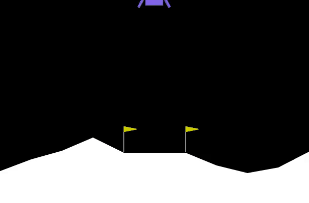

# Lunar Lander v3 - Deep Reinforcement Learning



## Table of Contents
- [Project Evolution](#project-evolution)
  - [Recent Upgrades](#recent-upgrades)
- [Implementation Details](#implementation-details)
  - [Custom (From Scratch)](#custom-from-scratch)
  - [External Libraries & Frameworks](#external-libraries--frameworks)
- [Key Features](#key-features)
- [Overcoming Challenges: Catastrophic Forgetting](#overcoming-challenges-catastrophic-forgetting)
- [Project Structure](#project-structure)
- [Getting Started](#getting-started)
  - [Installation](#installation)
  - [Running the Experiment](#running-the-experiment)
  - [Visualizing Results](#visualizing-results)
- [Technical Details](#technical-details)

## Project Evolution

This project is evolution of my earlier work on the **LunarLander-v2** environment. 

### Upgrades from LunarLander-v2
- **Gymnasium Migration:** Upgraded from the unmaintained OpenAI Gym to the community-maintained **Gymnasium** suite and the **LunarLander-v3** environment.
- **Improved Stability:** Integrated **Soft Target Network Updates** (Polyak Averaging) with $\tau_{soft}=0.005$ to solve catastrophic forgetting and stabilize learning.
- **Deeper Architecture:** Expanded the manual neural network to a **2-hidden layer MLP** (256-128 units) for increased modeling capacity.
- **Professional Architecture:** Reorganized into a modular structure (src/scripts/data/configs) with absolute imports and a proper Python package layout.
- **Modern Tooling:** Migrated to the **uv** package manager for deterministic dependencies and high-performance environment management.

## Implementation Details

### Custom (From Scratch)
- **Expected SARSA Agent:** A temporal-difference control algorithm that reduces variance by considering the expected value of next-state actions.
- **Manual Neural Network Implementation:** A multi-layer perceptron built using only **NumPy**, including manual forward propagation, backpropagation, and Saxe weight initialization. Supports deep architectures with multiple hidden layers.
- **Soft Target Updates:** Instead of hard synchronization, the target network slowly tracks the policy network at every step ($\theta_{target} \leftarrow \tau \theta_{local} + (1-\tau)\theta_{target}$).
- **Adam Optimizer:** A custom implementation of the Adam optimization algorithm for efficient weight updates.
- **Replay Buffer:** A circular buffer for experience replay to stabilize training by decorrelating observations.
- **Mathematical Utilities:** Custom Softmax and TD-error calculations.

### External Libraries & Frameworks
- **[Gymnasium](https://gymnasium.farama.org/):** Provided by the Farama Foundation (successor to OpenAI Gym). It provides the **LunarLander-v3** simulation, handling physics, state transitions, and reward definitions.
- **[Box2D](https://box2d.org/):** The underlying 2D physics engine used by Gymnasium for the lander simulation.
- **RLGlue:** A standard experimental interface used to bridge the agent and environment.
- **Numerical & Viz:** NumPy for linear algebra; Matplotlib, ImageIO, and TQDM for analysis and visualization.

## Key Features

- **Expected SARSA Agent:** A robust temporal-difference control algorithm that reduces variance by considering the expected value of next-state actions.
- **Manual Neural Network Implementation:** Features a multi-layer perceptron built with NumPy, including forward propagation, backpropagation, and weight initialization (Saxe initialization).
- **Target Network Synchronization:** Solves the "moving target" problem by using a dedicated target network for stable TD-error calculation, updated every 500 steps.
- **Adam Optimizer from Scratch:** A custom implementation of the Adam optimization algorithm for efficient weight updates.
- **Experience Replay:** Uses a replay buffer to stabilize training by breaking correlations in the sequence of observations.
- **Professional Project Structure:** Organized for scalability and clarity, following industry standards for research and development.

## Overcoming Challenges: Catastrophic Forgetting

During initial development, the agent experienced **Catastrophic Forgetting**—a phenomenon where the agent reaches a performance peak (e.g., +200 reward) but then suddenly "unlearns" and drops back to lower scores.

### The Solution
To stabilize learning, the implementation was upgraded from standard Expected SARSA to include:
1. **Decoupled Value Estimation:** We introduced a **Target Network** ($\hat{Q}$). While the **Policy Network** ($Q$) is updated at every step, the Target Network is only updated every 500 steps. This provides a stable "ground truth" for the agent to chase.
2. **Batch Optimization:** Increased minibatch sizes to 64 to ensure that weight updates are based on a statistically significant sample of experiences, reducing the noise that leads to forgetting.

## Project Structure

```text
.
├── configs/                # Configuration files (hyperparameters, environment settings)
├── data/
│   ├── results/            # Saved training rewards and performance metrics
│   └── weights/            # Saved model weights (.npy format)
├── docs/
│   ├── figures/            # Visualizations, plots, and weight distributions
│   └── videos/             # Recorded agent performance videos
├── scripts/                # Utility scripts for plotting, video generation, and testing
├── src/                    # Core source code
│   ├── agents/             # RL agent implementations (Base and Expected SARSA)
│   ├── environments/       # Environment wrappers and Gym integration
│   ├── models/             # Neural network and Replay Buffer definitions
│   └── utils/              # RLGlue, Optimizer, and Mathematical utilities
├── pyproject.toml          # Project metadata and dependencies (managed by uv)
├── uv.lock                 # Deterministic dependency lock file
└── .python-version         # Specified Python version for the project
```

## Getting Started

### Prerequisites

- [uv](https://docs.astral.sh/uv/) (Extremely fast Python package manager)

### Installation

1. Clone the repository:
   ```bash
   git clone <repository-url>
   cd Lunar_Lander
   ```
2. Set up the environment and install dependencies:
   ```bash
   uv sync
   ```

### Running the Experiment

To train the agent using the current configurations:
```bash
uv run python -m src.main
```

### Visualizing Results

Use the provided scripts to generate plots or videos (run as modules from project root):
```bash
# Generate the learning curve plot
uv run python -m scripts.viz_plot_script
# Record the agent's performance (mp4)
uv run python -m scripts.viz_video_agent
# Convert mp4 to a GIF for README display
uv run python -m scripts.convert_to_gif
```

## Technical Details

- **State Space:** 8-dimensional vector representing:
  1. **Horizontal Position** (x)
  2. **Vertical Position** (y)
  3. **Horizontal Velocity** (vx)
  4. **Vertical Velocity** (vy)
  5. **Angle** (theta)
  6. **Angular Velocity** (v_theta)
  7. **Left Leg Contact** (Boolean)
  8. **Right Leg Contact** (Boolean)
- **Action Space:** 4 discrete actions:
  - `0`: Do nothing
  - `1`: Fire left orientation engine
  - `2`: Fire main engine
  - `3`: Fire right orientation engine
- **Architecture:** Feed-forward neural network with ReLU activation for hidden layers and a Softmax policy for action selection (controlled by temperature parameter $\tau$).
